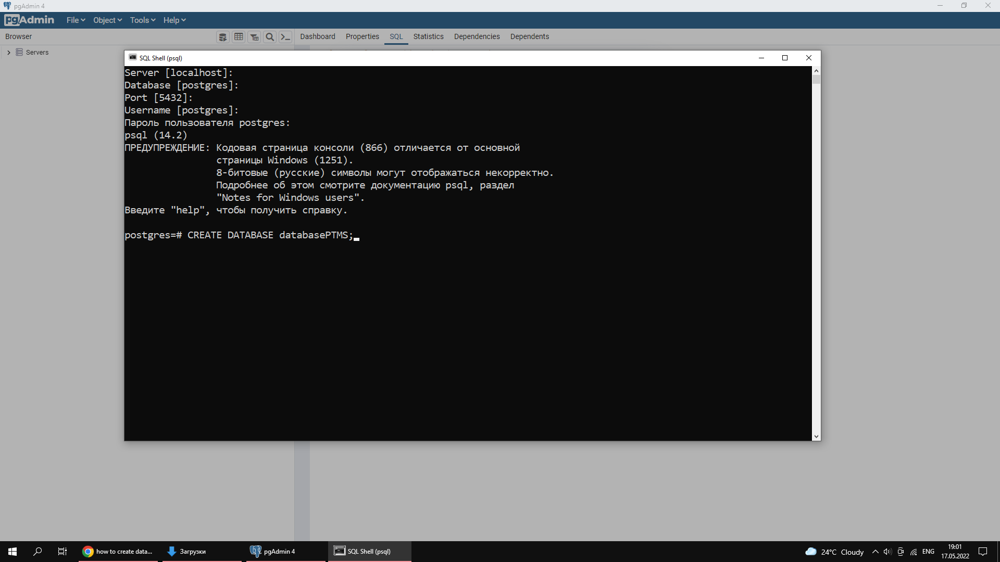
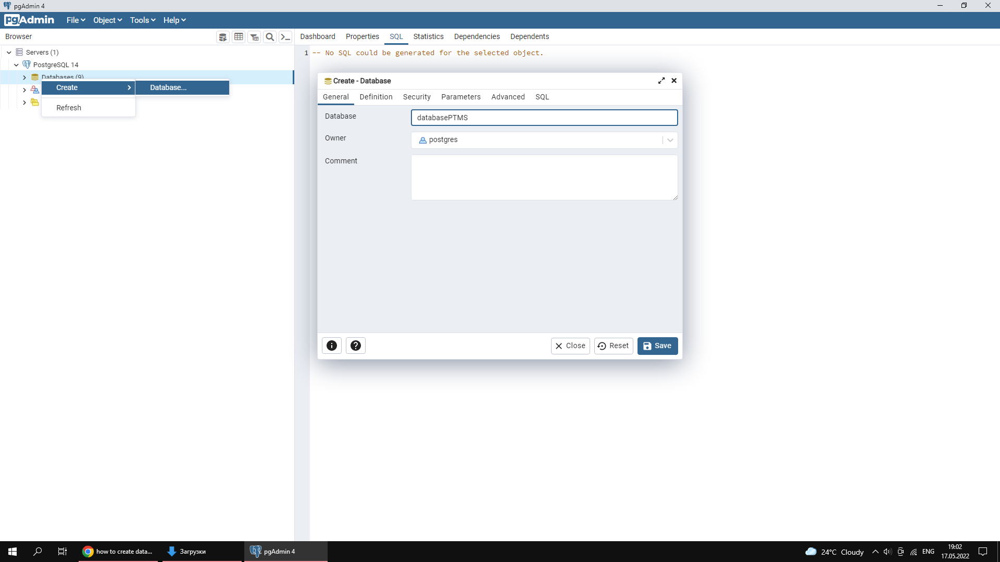
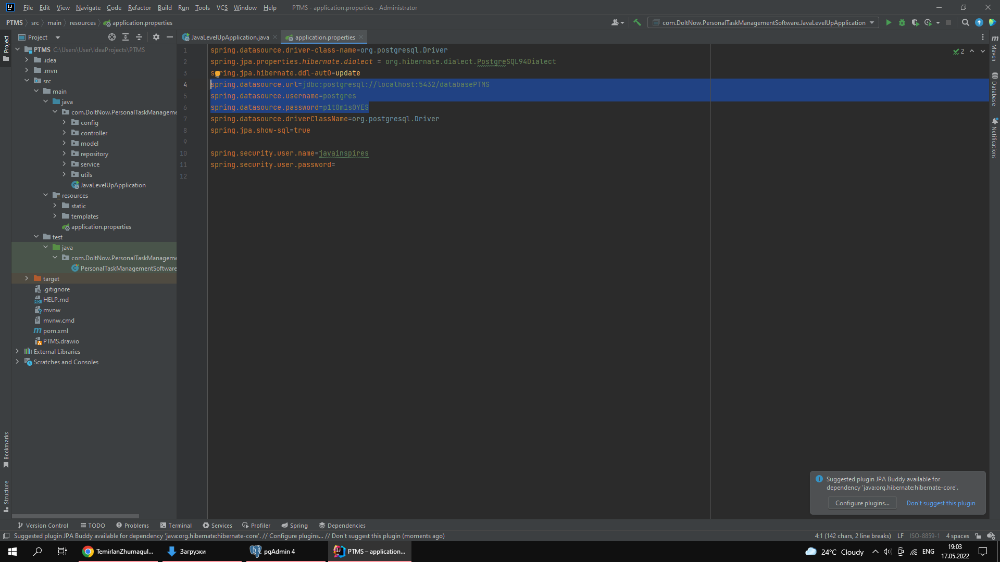
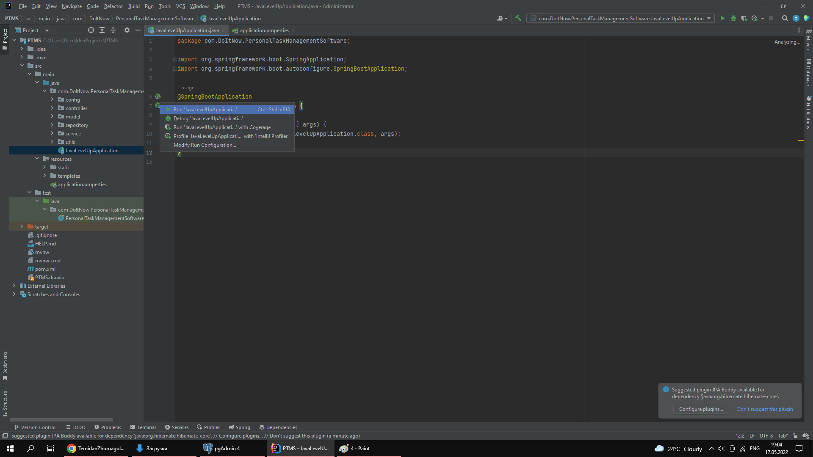
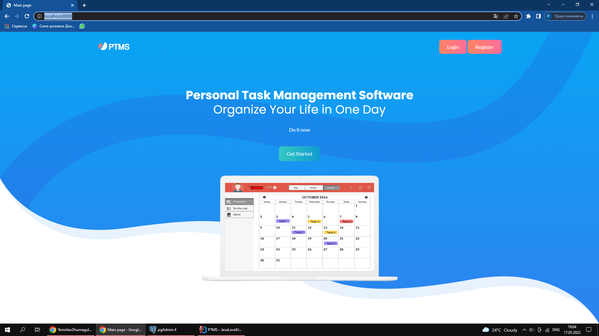

# PersonalTaskManagerSoftware

## Table of contents

- [Overview](#overview)
  - [Description](#description)
  - [How to launch an application on localhost](#How_to_launch_an_application_on_localhost)
- [Authors](#authors)

## Overview

### Description

Due to the increase in information consumed and the number of things that need to be done, an increasing percentage of people are beginning to feel overworked. The traditional method of using a notepad with a pen is beginning to lose its former effectiveness, because many of the same processes have to be repeated and their design may take longer than necessary. The development of PTMS will help with the automation of many processes, and the gamification of the system will increase the involvement, motivation and efficiency of the user.

### Special features of IS
Simplicity: Most similar applications are a bit difficult to use due to the large number of functions and details, which is why we decided to make the program minimalistic on the contrary.

Gamification: The planning process itself is boring for many people and after several times using the application they become too lazy to use the application. Therefore, adding elements of the game will increase interest.

### Practical value/Scope
As a product: in personal life.
As a system: in work, in education system.
Wherever there is a need for planning.
It should be remembered that this system is for individual use and there is no functionality for collaboration.

***Detailed description of the project in the Software Requirements Specification folder***

<a name="How_to_launch_an_application_on_localhost">### How to launch an application on localhost
</a> 

1. You can run the app on Intellij IDEA community edition 

2. You must have JDK 17 or above 

3. You must have PostgreSQL, if you don't have it, you can download it here https://www.postgresql.org/download/

4. You have to run pgAdmin or shell and create database

5. Change your the path to the database, username and password in the application.properties file as shown on your PostgreSQL 

6. Run the javaLevelUpApplication class

7. Type localhost:8080 in the browser address bar 

## Authors

- Me - [@TemirlanZhumagulov](https://github.com/TemirlanZhumagulov)
- Daniyaruly Danial - [@DaniyarulyDanial](https://github.com/daniyarulydanial)

