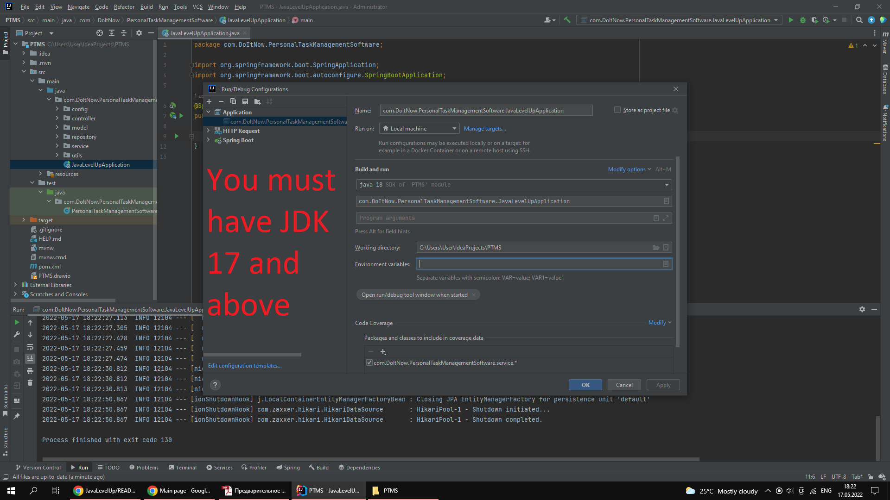
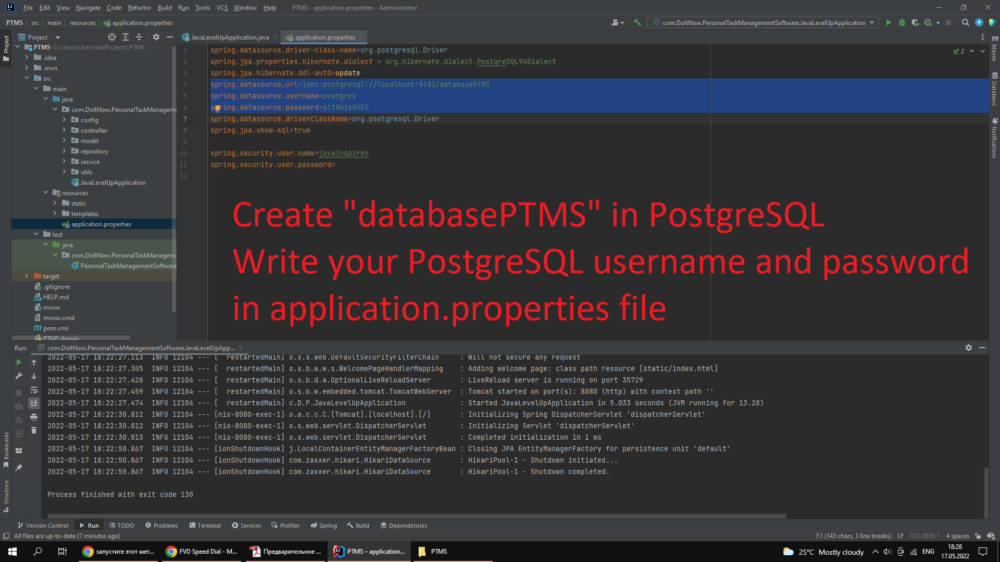
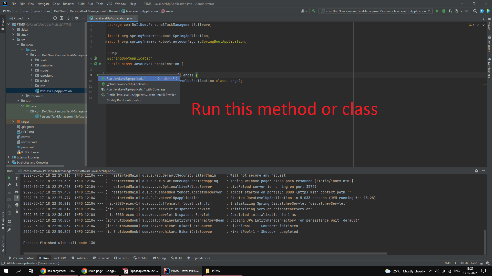
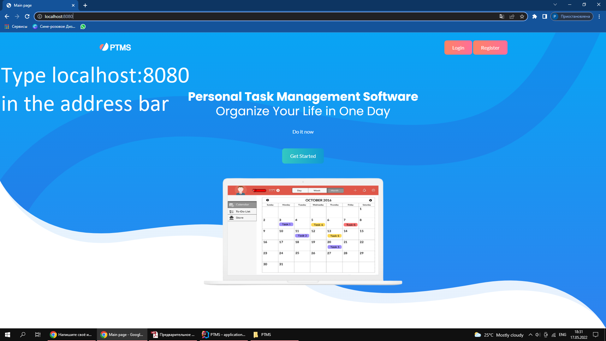

# PersonalTaskManagerSoftware

## Table of contents

- [Overview](#overview)
  - [Description](#description)
  - [How to launch an application on localhost](#screenshots)
- [My process](#my-process)
  - [Built with](#built-with)
  - [Useful resources](#useful-resources)
- [Authors](#authors)

## Overview

### Description

Detailed description of the project in the Software Requirements Specification folder

### How to launch an application on localhost

## My process

### Built with

- Spring Boot
- PostgreSQL
- PayPal Developer API
- Bootstrap
- CSS3
- HTML5
- JavaScript

### Useful resources

- [justcoded](https://justcoded.com/blog/how-to-integrate-a-payment-gateway-into-a-website/) - it helped me to integrate paypal API

## Authors

- Me - [@TemirlanZhumagulov](https://github.com/TemirlanZhumagulov)
- Daniyaruly Danial - [@DaniyarulyDanial](https://github.com/daniyarulydanial)

